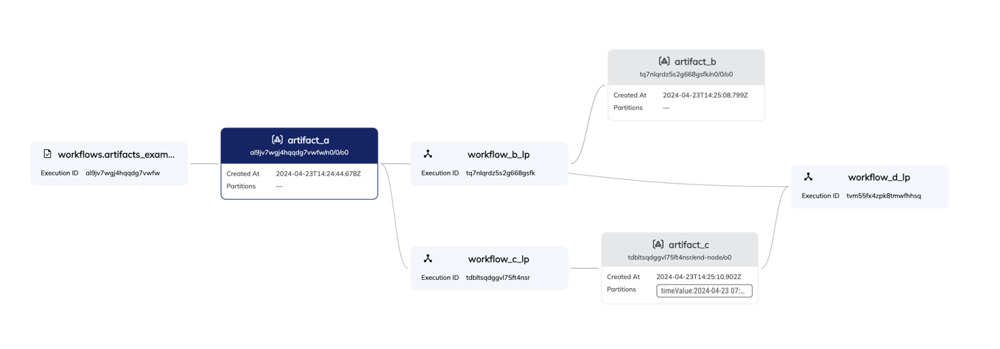

# flytesnacks-examples
Example workflows for the union flytesnacks project.

## Workflows
### artifact_example.py
This module contains example usage of artifacts through four reactive workflows connected via triggers.
The workflows contain minimal code as this example is meant to demonstrate various new features such as:
- **Triggers**: `workflow_a` triggers `workflow_b` and `workflow_c`. Then, `workflow_c` triggers `workflow_d` with input artifacts from `workflow_a` and `workflow_c`.
- **Partitions**: A time partition is added to `ArtifactC`. Partitions enable semantic grouping of artifacts.
- **Artifact Cards**: An artifact card is added to `ArtifactA` to visualize a simple pandas DataFrame in the UI.
- **Lineage Graph**: The lineage graph can show the relation of different artifacts to different workflows.
   

    